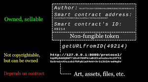

# Revolutionising API Marketplaces and Empowering the XRP Community

> "... a ground-breaking Web 3.0 marketplace set to revolutionise the way APIs are accessed, ..."

In an era of rapid digital transformation, the need for accessible, efficient, and monetisable APIs has never been more critical. Welcome Dhali, a ground-breaking Web 3.0 marketplace set to revolutionise the way APIs are accessed, deployed, and monetised. By leveraging the lightning speed and cost-effectiveness of XRP Ledger (XRPL) payment channels and integrating non-fungible tokens (NFTs) into the equation, Dhali has not only transformed the API landscape but has also opened up exciting opportunities for the XRP community. This post delves into Dhali's innovative platform, illustrating how it empowers the XRP community while paving the way for a new era of API usage and monetisation.

## The Power of XRP Ledger

> "... dramatically reducing costs and improving efficiency."

The XRP Ledger (XRPL) is a pivotal part of Dhali's formula for success. As a decentralized cryptographic ledger, XRPL offers fast, efficient, and cost-effective transactions that provide a robust infrastructure for digital marketplaces.

What sets XRPL apart is its speed and scalability. It can settle transactions in as little as 3-5 seconds, much faster than many other prominent blockchains. This speed is invaluable in a marketplace setting like Dhali, where real-time, efficient transactions are key to maintaining a smooth user experience.

Moreover, XRPL's payment channels, utilised by Dhali, allow for off-ledger transactions. This means parties can transact privately at high speeds and settle the net amount on the ledger, dramatically reducing costs and improving efficiency.

By harnessing the power of the XRP Ledger, Dhali is not only facilitating faster transactions but also enabling a more cost-effective and efficient marketplace. This ensures a seamless and profitable experience for developers and end-users alike, highlighting the potential of XRPL in revolutionising digital service transactions and making Dhali a standout player in the API marketplace ecosystem.

## APIs and NFTs

> "... In essence, every API call becomes a transaction where the NFT owner profits."

In the realm of APIs, monetisation can often be a complex process. Dhali has innovated a revolutionary approach by applying the concept of non-fungible tokens (NFTs) to APIs, a move that could redefine how API creators benefit from their work.

NFTs, unique digital assets maintained on a blockchain, are typically associated with digital art, music, or virtual real estate. However, Dhali leverages this technology to imbue APIs with the uniqueness and value traditionally associated with these tokens. Each API on Dhali's platform is tokenised as an NFT, representing a unique piece of digital property that's verifiable via the blockchain.

This method of tokenisation offers API developers a direct line of monetisation. When their API is accessed or utilised by a user, the transaction fee is directly transferred to the owner of the corresponding NFT. In essence, every API call becomes a transaction where the NFT owner profits.

The tokenisation of APIs through NFTs fosters a transparent and equitable marketplace. Developers get rewarded for every interaction with their APIs, and the value of their work is directly tied to its usage. This innovative use of NFTs in the Dhali platform allows API creators to capitalise on their contributions, bringing an exciting new dimension to the world of APIs.

## Opportunities for the XRP Community

The advent of Dhali brings forth an array of promising opportunities for the XRP community. Here's how:

1. **Cryptocurrency Price Prediction API**: This API uses machine learning algorithms to predict future cryptocurrency prices, including XRP. It analyses historical price data, market sentiment, and various other market indicators to provide the most accurate prediction. This would be beneficial for XRP traders and investors in forecasting potential market moves and making informed decisions.

2. **Blockchain Anomaly Detection API**: Utilising machine learning, this API can identify irregular patterns and potential fraudulent activities on the blockchain. For the XRP community, this would enhance security and trust in transactions conducted on the XRPL.

3. **Smart Contract Validator API**: This API could employ machine learning techniques to verify the integrity and reliability of smart contracts on the XRPL. By learning from past contracts and their outcomes, it could highlight potential issues before they become problems, helping the XRP community use smart contracts more effectively and safely.

4. **Cryptocurrency News Aggregator and Sentiment Analysis API**: This API applies machine learning to gather and analyze news and social media chatter about XRP. It could give the community insights into the overall market sentiment, helping them gauge the public perception of XRP and predict possible market reactions.

5. **DeFi Optimization API**: With the rise of decentralized finance (DeFi) on multiple platforms, including XRP Ledger, this API uses machine learning to suggest the most optimal DeFi strategies for users. By analyzing historical DeFi data, current market conditions, and user preferences, it can offer personalized recommendations, helping XRP DeFi users maximize their returns.

6. **XRPL Validator Honesty API:** Leveraging machine learning techniques, this API analyses the performance and activities of XRPL validators. It assesses their behaviour patterns and compares them against pre-defined honesty parameters such as their agreement rate, ledger chain stability, and uptime. With continuous learning and updates, this API provides valuable insights into the reliability and honesty of XRPL validators, contributing to the overall integrity of the XRP network.

These APIs demonstrate the potential of combining machine learning with the specifics of the XRP ecosystem, providing tools and services that can empower and support the community in various ways.

## Conclusion

> "... a potent fusion of innovative technology, practical application, and community empowerment."

Dhali is more than just a Web 3.0 API marketplace; it's a potent fusion of innovative technology, practical application, and community empowerment. By harnessing the efficiency of the XRP Ledger and the uniqueness of NFTs, Dhali has paved a new path in the API economy, democratising access, deployment, and monetisation. For the XRP community, it represents an exciting opportunity to participate directly in this revolution, either as API developers, users, or both. As we look to the future of digital ecosystems, the power of XRP, combined with the vision of Dhali, showcases the transformative potential of blockchain technology and its capacity to redefine entire sectors. So, let's embrace this wave of innovation and explore the vast possibilities Dhali and XRP together bring to our doorstep.