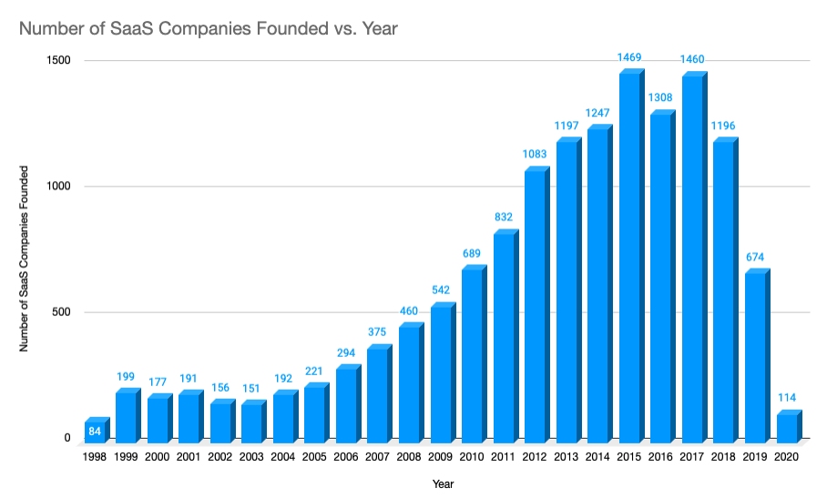
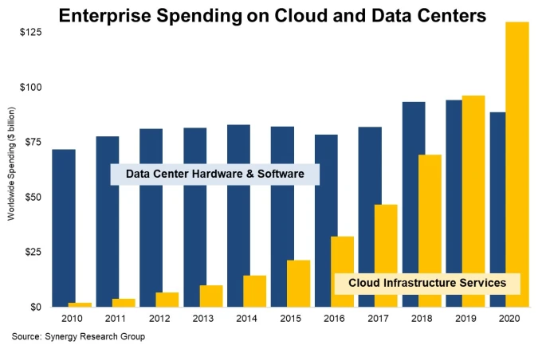
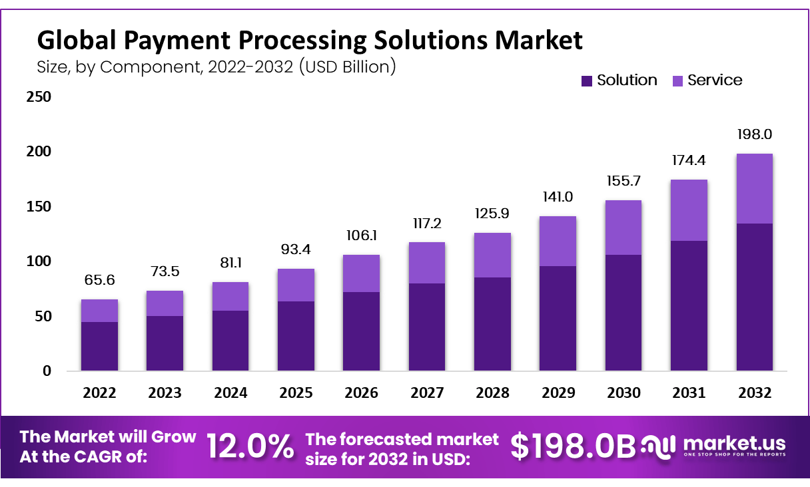

# The Evolution of SaaS: Cap-ex, Op-ex, and "Mon-ex"

The history of Software as a Service (SaaS) is a fascinating journey through the rapidly changing landscape of the internet. Since its inception, SaaS companies have faced several distinct but interconnected challenges - Cap-ex (Capital Expenditure), Op-ex (Operating Expenditure), and Mon-ex (Monetization Expense). Let's journey through the evolution of SaaS, examining how each of these challenges has shaped the industry, starting from the 1990s and progressing into the present day.

**The 1990s: Cap-ex, Op-ex, and Mon-ex in the SaaS Landscape**

The 1990s marked the birth of SaaS. Since then, the SaaS market size has grown tremendously, and is expected to hit $232 billion by 2024. Notable examples of early SaaS companies were:
1. Salesforce, founded in 1999 and currently valued at $205.23 billion, developed tooling for customer management.
2. Concur Technologies (now SAP Concur), founded in 1993 currently valued at $155.1 billion, provided travel and expense management services to businesses.
3. WebEx (now part of Cisco), founded in 1995 and currently valued at $208.2 billion, provided web conferencing solutions.
4. NetSuite (now part of Oracle), founded in 1998 and currently valued at $311.9 billion, provided - among other things - financial and customer relationship management solutions.
5. Ariba (now SAP Ariba), founded in 1996 and currently valued at $155.2 billion, developed tooling to facilitate and improve the procurement process for large corporations.

    

[Image source](https://cardconnect.com/launchpointe/tech-trends/rise-of-saas)

But with its inception, these early pioneers of the SaaS model were hit by simultaneous challenges of Cap-ex, Op-ex, and Mon-ex. 

Cap-ex represents the initial investments required to set up the infrastructure for a business. For a SaaS company in the 1990s, this meant significant spending on servers, data centers, and networking hardware. Think of a fledgling SaaS company having to purchase an entire server farm to host their application.

Op-ex refers to the ongoing operational costs of running a business. For SaaS companies, this includes the costs of maintaining servers, developing software, providing customer support, and more. Picture the ongoing costs to keep those server farms cool, secure, and operational.

Mon-ex represents the challenges and costs associated with implementing and managing monetization strategies for SaaS businesses. Simply put, it's the cost needed to facilitate the flow of money into and out of the business. This could involve the expense of integrating with payment providers, optimizing a revenue model, managing currency selection for different markets, and navigating regulatory landscapes. In the 1990s, SaaS businesses needed to set up a merchant account, purchase or lease payment gateway software, and integrate this software into their website, which required substantial technical skills or the hiring of developers. All of this came at a large cost to businesses, substantially increasing frictions and time-to-market.

**The 2000s: The Cloud Era Alleviates Cap-ex**

The advent of cloud computing in the 2000s marked a seismic shift in the SaaS landscape. Companies such as Amazon, Google, and Microsoft began offering cloud-based services, which allowed SaaS companies to lease server space rather than buying and maintaining their own, significantly reducing Cap-ex.

    

[Image source](https://techcrunch.com/2021/03/19/cloud-infrastructure-spending-passed-on-prem-data-centers-in-2020/)

Now, instead of purchasing and maintaining server farms, SaaS companies could pay for exactly what they used. This shift to a scalable, pay-as-you-go model transformed the industry by lowering the financial barrier to entry for new SaaS companies. An [article from Forbes](https://www.forbes.com/sites/quora/2019/12/20/how-much-money-can-businesses-save-by-moving-to-the-cloud/) indicated that firms could save between 30 and 50% by moving their on-prem systems into the cloud. Critically, the emergence of cloud has allowed the "little guys" to effectively compete on the world stage. And as a result, we all benefitted. 

But the problems that SaaS companies faced were not over. All those rented servers that sat in the cloud still needed managing. And this management still came at great expense;  it required considerable Op-ex.

**The 2010s: Serverless Computing and the Reduction of Op-ex**

The 2010s brought another major evolution with the rise of serverless computing. This technology allowed SaaS companies to run their applications without having to manage any underlying infrastructure, significantly reducing Op-ex. Now, even the task of managing servers (patching them, securing them, ensuring uptime) could be outsourced to the cloud providers.

Serverless architecture didn't just lower costs; it allowed SaaS companies to focus more on their core product and less on the operational challenges of maintaining a reliable, scalable infrastructure. Again, this move was incredibly powerful for the "little guys".

**The 2020s and Beyond: Tackling Mon-ex**

But still, the problems of SaaS companies are not over. With the advent of payment service providers (PSPs) like Stripe, Square, or PayPal, some of the challenges of accepting payments from customers have been reduced. For example, businesses now no longer needed to set up their own individual merchant account because their transactions could be processed through the provider's merchant account.

While using PSPs has advantages in terms of ease of setup and simplicity, there can also be drawbacks. These can include higher transaction fees (typically between 1.5 and 3.5%), less control over the payment process, and a potentially higher risk of having the account frozen or terminated because the payment provider is managing risk on a portfolio basis. Moreover, because of these issues, certain monetization routes become completely infeasible. Imagine trying to operate a company that generates revenue through large volumes of small individual sales. If each transaction comes with a flat fee, as often the case for modern PSPs, the costs to the company can quickly become exorbitant. 

The global PSP market size is [expected to reach](https://www.globenewswire.com/news-release/2023/04/10/2643500/0/en/Payment-Processing-Solutions-Market-Projected-to-Reach-Valuation-of-US-198-0-Bn-at-12-CAGR-from-2023-2032.html) $155.7 billion by 2030. That's $155.7 billion dollars of financial friction, which we could use to estimate where global Mon-ex is heading.

    

As we look towards the future, emerging Web3 and blockchain technologies are poised to disrupt this landscape and alleviate some of the burdens associated with Mon-ex. The inherent features of these technologies – decentralization, transparency, and automation – pave the way for more efficient and cost-effective monetization mechanisms. As we saw with reduction of Cap-ex and Op-ex, the competitive landscape will be further flattened, enabling the "little guys" to compete more effectively, and focus on the interesting problems.

**Conclusion: The Ever-evolving SaaS Landscape**

The history of SaaS has been marked by the continuous evolution of challenges and solutions. From the Cap-ex heavy 1990s, through the Op-ex focused 2000s and 2010s, and now into the Mon-ex era of the 2020s, each phase has introduced new obstacles and innovative solutions.

The SaaS model has proven to be incredibly resilient and adaptive, and as we look to the future, it's exciting to imagine what the next evolution will be. One thing is certain: just as SaaS companies have successfully navigated Cap-ex and Op-ex, they will find ways to tackle the challenges of Mon-ex, continuing to push the boundaries of what's possible in the software industry.